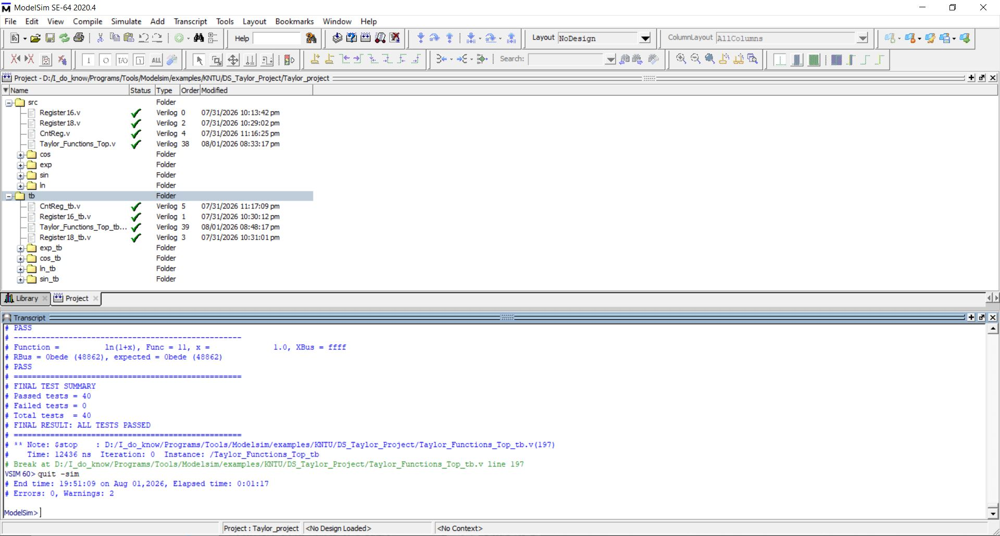
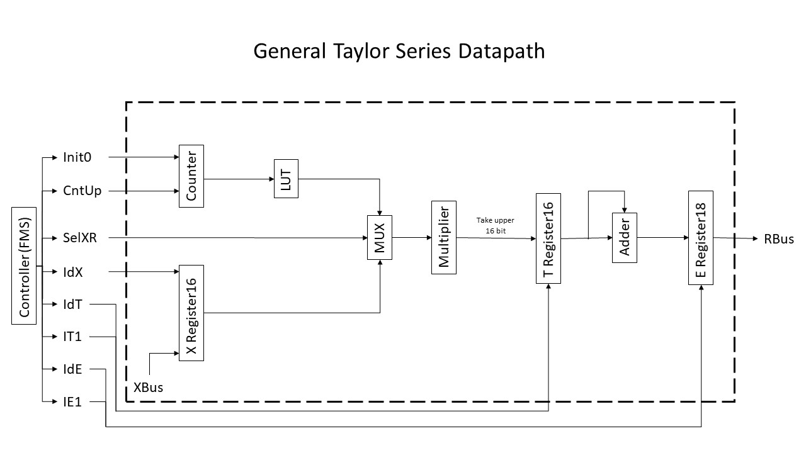
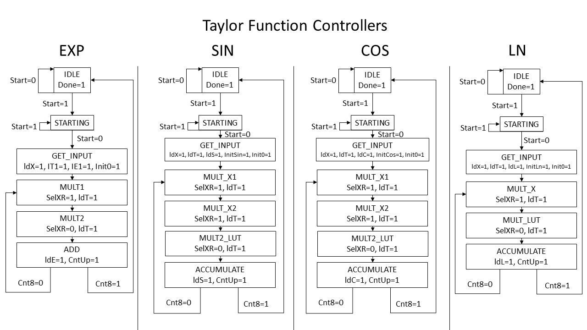

# Taylor Series Function Processor (Verilog)

A modular digital hardware implementation of a **Taylor Series Function Processor** in Verilog.

The processor evaluates four mathematical functions using fixed-point arithmetic and finite state machine (FSM) based controllers:

- Exponential: **exp(x)**
- Sine: **sin(x)**
- Cosine: **cos(x)**
- Natural Logarithm: **ln(1+x)**

The project was developed in Verilog and verified using **ModelSim** with unit-level and system-level testbenches.

---

# Features

- Modular RTL design
- Separate datapath and controller for each function
- Shared reusable hardware modules
- Fixed-point arithmetic (Q2.16 format)
- FSM-based control
- Top-level function selector
- Comprehensive simulation and verification
- Automated testbenches

---

# Architecture

The processor consists of:

- Common reusable modules
    - Register16
    - Register18
    - Counter

- Function-specific implementations
    - Exponential
    - Sine
    - Cosine
    - Logarithm

- Top-level processor
    - Function selector
    - Common interface
    - Shared input/output

---

# Directory Structure

```text
Taylor-Series-Processor
│
├── src
│   ├── Register16.v
│   ├── Register18.v
│   ├── CntReg.v
│   │
│   ├── exp/
│   ├── sin/
│   ├── cos/
│   ├── ln/
│   │
│   └── Taylor_Functions_Top.v
│
├── tb
│   ├── Common testbenches
│   ├── exp_tb/
│   ├── sin_tb/
│   ├── cos_tb/
│   ├── ln_tb/
│   └── Taylor_Functions_Top_tb.v
│
├── docs
│   ├── Datapath_Diagram.jpg
│   ├── Controllers.jpg
│   ├── Waveform.jpg
│   ├── Project_Structure.jpg
│   └── Finaltb_Transcript.txt
│
└── README.md
```



---

# Top-Level Interface

| Signal | Width | Description |
|---------|------:|-------------|
| clk | 1 | System clock |
| rst | 1 | Asynchronous reset |
| Start | 1 | Starts computation |
| Func | 2 | Function selector |
| XBus | 16 | Input operand (fixed-point) |
| Done | 1 | Indicates completion |
| RBus | 18 | Computed result |

## Function Selection

| Func | Function |
|------|----------|
| 00 | exp(x) |
| 01 | sin(x) |
| 10 | cos(x) |
| 11 | ln(1+x) |

---

# Datapath

The datapath is composed of reusable hardware blocks:

- Counter
- Lookup Table (LUT)
- Multiplexer
- Fixed-point Multiplier
- 16-bit Register
- 18-bit Accumulator Register
- Adder

The same overall architecture is reused for all implemented Taylor series functions with function-specific LUT values and controller sequencing.



---

# Controller FSMs

Each function is controlled by an independent finite state machine (FSM).

The controllers manage:

- initialization
- loading registers
- multiplication sequence
- accumulation
- iteration control
- completion signaling



---

# Verification

Each module has an independent testbench.

Verification includes:

- Register modules
- Counter
- Lookup Tables
- Datapaths
- Controllers
- Top-level modules
- Complete integrated processor

The final integration testbench verifies all four implemented functions using multiple input values.

Example functions tested:

- exp(x)
- sin(x)
- cos(x)
- ln(1+x)

---

# Example Simulation Results

## Final Test Summary

```
Passed tests = 40
Failed tests = 0
Total tests  = 40

FINAL RESULT: ALL TESTS PASSED
```

---

## Example Waveform


---

# Technologies Used

- Verilog HDL
- ModelSim SE-64
- Fixed-point arithmetic
- RTL Design
- Finite State Machines (FSM)
- Digital Datapath Design

---

# Author

Ali Heidari
